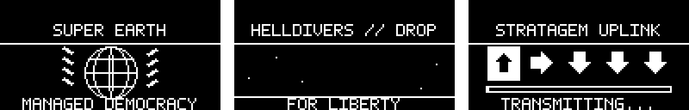
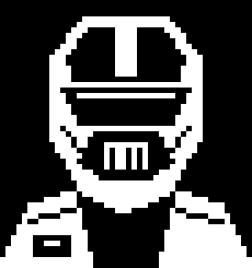

# Helldivers-inspired Flipper Zero animations

An original, unofficial fan animation pack for Momentum firmware. The current version includes sharper 5×7 pixel lettering, content lowered to clear the clock, and inverted monochrome colours.



## Included animations

- **Super Earth:** rotating globe and laurels, with “MANAGED DEMOCRACY”.
- **Hellpod Drop:** descent and landing, with “FOR LIBERTY”.
- **Stratagem Uplink:** **↑ → ↓ ↓ ↓**, a progress bar, and “UPLINK READY”.

Each animation contains 16 frames at 128×64 pixels, playing at 6 fps.

## Helldiver passport

The pack also replaces the dolphin passport portrait with an original 46×49 pixel Helldiver helmet and armour. All three mood portraits are included; your dolphin's name, level and statistics stay the same. Open the passport by pressing Right on the desktop.



## Install

Download and extract [Helldivers_asset_pack.zip](Helldivers_asset_pack.zip). The complete editable project, including the native frame folders, is in [Helldivers_Project_source.zip](Helldivers_Project_source.zip).

Copy the `Helldivers` folder to your Flipper SD card's `asset_packs` directory using qFlipper. Select **Momentum → Interface → Graphics → Asset Pack → Helldivers**, then exit settings to apply it. Select another pack at the same location to switch back.

When updating an already selected pack, briefly select another pack, then select Helldivers again and exit settings to reload the new icons.

This project contains graphics only. No BadUSB payloads, executable device applications, or game assets are included.

## Rebuild

Use Python 3 with Pillow installed:

```sh
python -m pip install -r requirements.txt
python build_helldivers.py
```

The generator writes the pack, previews, a ZIP archive, and bitmap checksums in the project directory. It decodes every generated bitmap and checks its pixels against the source image.

## Attribution

Unofficial fan artwork inspired by Helldivers. This project is not affiliated with or endorsed by the game's creators or publishers.
